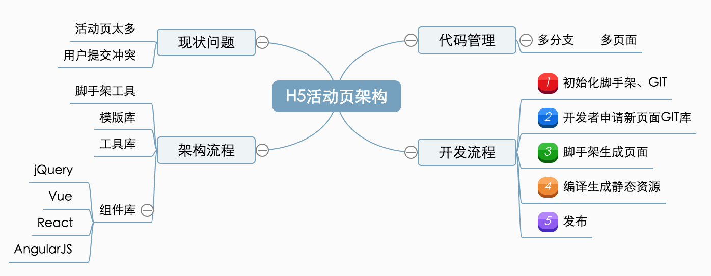

# tqb-h5-cli - HTML5 boilerplate and build tool

newh5 - 面向开发者的灵活可扩展的 HTML5 构建工具，提供命令行工具 newh5（基于 Webpack4），**无需构建配置文件即可进行开发**，可用来制作各种 HTML5 场景营销活动页面，也可自由的通过模板和组件的组合来快速定制开发。

公司H5活动页整体解决方案




## Usage

```sh
npm install newh5-cli
```

## 知识图
- [GitLab](https://about.gitlab.com/)
- [npm 私服工具verdaccio](https://github.com/verdaccio/verdaccio)
- [jenkins](https://jenkins.io/)
- [模版](https://github.com/newh5-templates)

## 工具文档
- [Webpack4](https://doc.webpack-china.org/)
- [commitizen: git commit message](https://taoqianbao.github.io/2018/03/06/git/git-cz/)
- [ora: Elegant terminal spinner](https://www.npmjs.com/package/ora)
- [axios: Promise based HTTP client for the browser and node.js](https://github.com/axios/axios)
- [commander: the complete solution for node.js command-line programs](https://www.npmjs.com/package/commander) 
- [commander: API Document](http://tj.github.io/commander.js/) 
- [cross-spawn: A cross platform solution to node's spawn and spawnSync.](https://github.com/moxystudio/node-cross-spawn)
- [chalk: Terminal string styling done right](https://github.com/chalk/chalk)
- [less]()
- [node-sass]()
- [sass]()
- [download-git-repo: Download and extract a git repository (GitHub, GitLab, Bitbucket) from node.](https://www.npmjs.com/package/download-git-repo)
- [inquirer: A collection of common interactive command line user interfaces.](https://www.npmjs.com/package/inquirer#documentation)


## Tips
cross-spawn 模块是解决跨平台调用系统命令的问题，Node.js 的子进程 (child_process) 模块下有一 spawn 函数，可以用于调用系统上的命令。


## loaders
css-loader exports-loader file-loader html-loader image-webpack-loader less-loader postcss-loader sass-loader script-loader style-loader stylus-loader url-loader